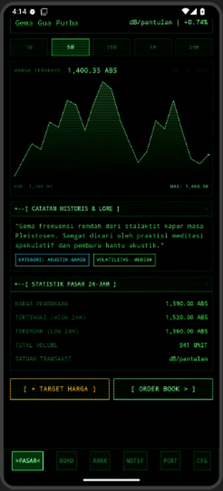
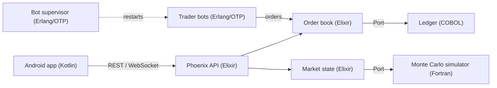

<div align="center">

# Absurd Commodities Exchange

**A satirical stock exchange for intangible commodities: echoes, daydreams, clouds and library whispers.**

An Android trading terminal (Kotlin) backed by a four-language engine: **Elixir**, **Erlang/OTP**, **Fortran** and **COBOL**.

[](https://github.com/Zanyrid/Stock-Exchange-/actions/workflows/build-apk.yml)
[](LICENSE)




</div>

---

## What is this?

An experiment in building something deliberately weird with deliberately old and unusual languages.
The exchange trades fictional commodities such as *Ancient Cave Echo* and *Procrastination Time*.
Prices are simulated, bots trade against each other, and every trade is written to a ledger by a COBOL program that prints mainframe-style fixed-column reports.

It is a playground, not financial software. No real money, no real markets.

## Features

**Android app (Kotlin)**
- Retro green-on-black terminal look with CRT scanlines
- Commodity list with live price charts and 24h stats
- Order book with market depth, plus market and limit orders
- Trader leaderboard and price alerts with notifications
- Configurable backend address in Settings, with an offline fallback to local dummy data

**Backend**
- REST API and WebSocket (Phoenix Channels) in Elixir
- Order book with price-time priority matching
- Six trader bots as Erlang processes; kill one and its supervisor brings it back
- Monte Carlo price simulation in Fortran, including random "echo storm" events
- COBOL ledger with fixed-column reports and an integrity audit

## Architecture



| Language | Role | Where |
|---|---|---|
| Kotlin | Android client | `app/` |
| Elixir | API, order book, orchestration | `backend/lib/` |
| Erlang | Trader bots, supervisor, manager | `backend/src/` |
| Fortran | Monte Carlo price simulation | `backend/native/fortran/` |
| COBOL | Transaction ledger, reports, audit | `backend/native/cobol/` |

**How one trade flows:** a bot (Erlang) submits an order, the order book (Elixir) matches it, the trade is broadcast to connected clients, the involved bots are notified, and COBOL appends it to the ledger. In the background, Fortran keeps moving the spot prices.

## Commodities

| Ticker | Name |
|---|---|
| `GMA.GUA` | Ancient Cave Echo |
| `MMP.SNG` | Midday Daydream |
| `AWN.KUM` | Cumulus Cloud |
| `BSK.PST` | Library Whisper |
| `ARM.HJN` | Petrichor |
| `KNG.DJV` | Deja Vu Nostalgia |
| `NST.KST` | Dusty Cassette Nostalgia |
| `WKT.TND` | Procrastination Time |

## Getting started

### Install the Android app

The APK is built by GitHub Actions on every push.

1. Open the **Actions** tab and pick the latest successful **Build APK** run.
2. Download the `bursa-absurd-debug-apk` artifact and unzip it.
3. Install the `.apk` on your phone (allow *install unknown apps* if asked).

This is a **debug** build meant for personal use, not a Play Store release.

### Run the backend

Requirements: Erlang/OTP, Elixir 1.14+, `gfortran`, `gnucobol`, `make`.

```bash
cd backend
make setup          # fetch deps, compile Fortran and COBOL
mix run --no-halt   # API on http://localhost:4000
```

Then try it:

```bash
curl localhost:4000/api/market/prices
curl localhost:4000/api/bots
curl -X POST localhost:4000/api/bots/BOT_ZEN_04/crash   # watch the supervisor restart it
curl localhost:4000/api/ledger/report                    # COBOL report
```

More detail, including the full endpoint list, is in [`backend/README.md`](backend/README.md).

> **Note:** the app ships with local dummy data. Pointing it at a running backend requires the server to be reachable from your phone (same network, a tunnel, or a hosted instance), and the app's API client to match the endpoints above. See the roadmap.

### Sample ledger report

Printed by the COBOL program (`GET /api/ledger/report`):

```text
==================================================================================================
                           BURSA KOMODITAS ABSURD - LAPORAN BUKU BESAR
==================================================================================================
TX ID        TIMESTAMP           TRADER BOT      KOMODITAS SIDE    QTY        HARGA          TOTAL
--------------------------------------------------------------------------------------------------
TX-000000016 2026-09-30 23:15:07 BOT_FOMO_05     BSK.PST   BUY       1       310.23         310.23
TX-000000016 2026-09-30 23:15:07 BOT_CONTRA_02   BSK.PST   SELL      1       310.23         310.23
TX-000000019 2026-09-30 23:15:09 BOT_FOMO_01     KNG.DJV   BUY       2       453.78         907.56
TX-000000019 2026-09-30 23:15:09 BOT_CONTRA_06   KNG.DJV   SELL      2       453.78         907.56
```

## API overview

| Method | Path | Description |
|---|---|---|
| GET | `/api/market/prices` | Current price of every commodity |
| GET | `/api/market/orderbook/:symbol` | Bids and asks |
| GET | `/api/market/trades` | Recent trades |
| POST | `/api/market/simulate-step` | Run a Fortran simulation for one symbol |
| GET | `/api/market/leaderboard` | Trader ranking |
| POST | `/api/orders` | Place a limit order |
| GET | `/api/bots` | Bot status, including restart counts |
| POST | `/api/bots/:id/crash` | Crash a bot on purpose |
| GET | `/api/ledger/report` | COBOL fixed-column report |
| GET | `/api/ledger/audit` | COBOL ledger integrity check |

WebSocket: `ws://HOST:4000/socket/websocket`, topic `market:lobby` (Phoenix Channels protocol).

## Tests

```bash
cd backend
make test
```

The ExUnit suite covers order matching, bot supervision and restart counting, and the Fortran/COBOL ports. Native-binary tests are skipped automatically if `make native` has not been run.

## Project structure

```text
.
├── app/                  Android app (Kotlin)
├── gradle/               Gradle wrapper files
├── backend/
│   ├── lib/              Elixir: API, order book, market state, ports
│   ├── src/              Erlang: trader bots, supervisor, manager
│   ├── native/
│   │   ├── fortran/      Monte Carlo simulator
│   │   └── cobol/        Ledger, reports, audit
│   └── test/             ExUnit tests
└── .github/workflows/    APK build pipeline
```

## Roadmap

- [ ] Connect the Android client to the live backend (REST polling first)
- [ ] `Dockerfile` and a free hosting setup for the backend
- [ ] Authentication for order and bot endpoints
- [ ] Persistent ledger storage
- [ ] Mean reversion so simulated prices cannot drift forever
- [ ] English text in the COBOL report
- [ ] Signed release APKs

## Known limitations

- The backend has **no authentication**. Do not expose it to the internet as is.
- Some dependencies are pinned to older versions to work with Erlang/OTP 25, and the build reports security advisories for them. Update them before any public deployment.
- The ledger is a plain file and is lost if the server's disk is ephemeral.
- Android builds are unsigned debug builds.

## Contributing

Issues and pull requests are welcome. For larger changes, please open an issue first.

## License

Released under the [MIT License](LICENSE).

## Acknowledgements

The Android client was scaffolded with Google AI Studio (Gemini). The backend was written with Claude and then built, tested and debugged by hand.
